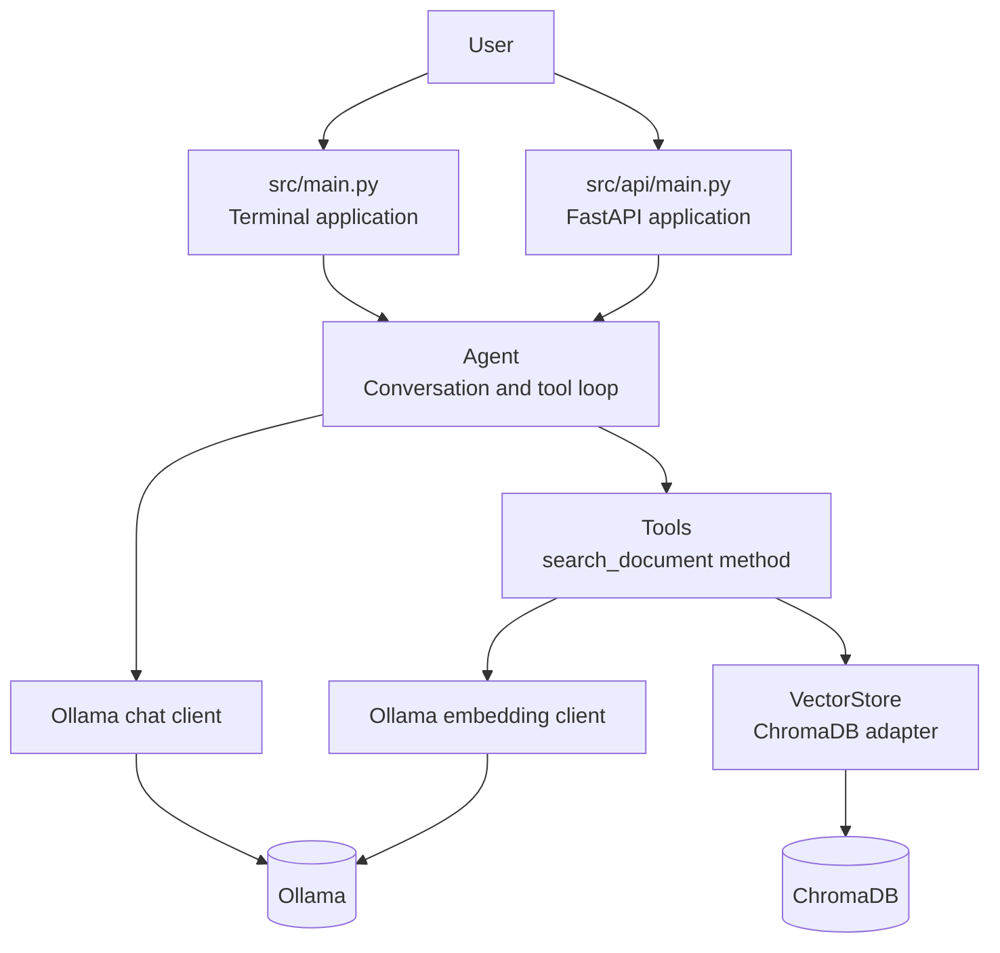

# Local Document Agent - Project Summary

## Project Overview

Built a local document question-answering application that lets a user ask questions about a PDF and receive answers grounded in the document. The application uses retrieval-augmented generation (RAG): it extracts and indexes document text first, then retrieves relevant passages before asking the local language model to answer.

The system is designed to run locally. Ollama provides both the chat model and embedding model, while ChromaDB stores and searches the document vectors.

## What Was Built

- PDF text extraction with PyMuPDF.
- Page-aware document processing.
- Overlapping text chunking for better retrieval across chunk boundaries.
- Ollama embedding integration for document chunks and user queries.
- ChromaDB vector-store adapter for persistent local similarity search.
- Explicit tool-calling agent loop with a configurable maximum number of rounds.
- `Tools` class with a clear `search_document()` method.
- Ollama chat integration with configurable timeouts and operational logging.
- Terminal application entry point in `src/main.py`.
- FastAPI application in `src/api/main.py`.
- Shared dependency wiring for the CLI and API.
- Centralized environment-based configuration.
- Timestamped logs for ingestion, retrieval, tool calls, model requests, and API requests.
- Architecture and deployment documentation in `README.md`.

## Architecture



### Ingestion flow

1. The application checks whether the configured ChromaDB collection is empty.
2. `document_loader.py` extracts text from each PDF page.
3. `chunker.py` splits page text into overlapping `DocumentChunk` records.
4. Each chunk is sent to Ollama to create an embedding vector.
5. `vector_store.py` stores the vectors, chunk text, document name, and page number in ChromaDB.

### Question flow

1. The user submits a question through the terminal or API.
2. `Agent` sends the conversation and the `search_document` tool schema to Ollama.
3. Ollama decides whether it needs document context.
4. The `Tools.search_document()` method embeds the search query and asks ChromaDB for relevant chunks.
5. Retrieved chunks and page metadata are returned to the agent.
6. Ollama produces the final answer using the retrieved context.
7. The answer is returned to the user.

## Main Components

| Component                | Responsibility                                                              |
| ------------------------ | --------------------------------------------------------------------------- |
| `src/main.py`            | Terminal entry point, ingestion check, service wiring, and chat loop.       |
| `src/api/main.py`        | FastAPI application, health route, chat route, and HTTP request logging.    |
| `src/agent.py`           | Conversation state, model/tool decisions, tool execution, and round limits. |
| `src/tools.py`           | `Tools` class and the `search_document` tool schema and implementation.     |
| `src/ingestion.py`       | Shared PDF ingestion pipeline.                                              |
| `src/document_loader.py` | PDF-to-page-text extraction.                                                |
| `src/chunker.py`         | Page text to overlapping document chunks.                                   |
| `src/vector_store.py`    | ChromaDB connection, storage, collection checks, and search.                |
| `src/embeddings/`        | Embedding interface and Ollama implementation.                              |
| `src/llm/`               | Chat interface and Ollama implementation.                                   |
| `src/data_models.py`     | `PageText`, `DocumentChunk`, and `SearchResult` data structures.            |
| `src/config.py`          | Environment-backed application settings.                                    |
| `src/logging_config.py`  | Shared logging configuration.                                               |

## Design Decisions

- **Interfaces at provider boundaries:** the agent depends on `ChatClient`, and document tools depend on `EmbeddingClient`, so the application is not tightly coupled to Ollama.
- **One ingestion pipeline:** CLI and future upload flows can reuse `ingest_pdf()` rather than implementing separate ingestion logic.
- **Named tool class:** `Tools` owns the vector store and embedding client dependencies, making the tool behavior easier to test and extend than a nested closure.
- **Composition roots:** `main.py` and `api/main.py` decide which concrete implementations to create. Core logic does not construct infrastructure internally.
- **Local-first operation:** documents, embeddings, model calls, and vector search remain on locally managed services.
- **Metadata-only operational logs:** logs include counts, durations, model names, and lifecycle events without logging document text or user prompts.
- **Bounded agent loop:** `MAX_TOOL_ROUNDS` prevents a model from repeatedly calling tools forever.
- **Explicit validation:** chunk settings reject zero or negative sizes and overlaps that would prevent the chunk window from advancing.

## Technologies

- Python
- FastAPI
- Uvicorn
- Ollama
- ChromaDB
- PyMuPDF
- Requests
- Docker Compose
- Dataclasses
- Python logging

## Running The Project

Start the infrastructure:

```bash
docker compose up -d
```

Install the application:

```bash
python3 -m venv .venv
source .venv/bin/activate
pip install -r requirements.txt
cp .env.example .env
```

Pull the Ollama models:

```bash
docker exec -it ollama ollama pull llama3.1:8b
docker exec -it ollama ollama pull nomic-embed-text
```

Run the terminal application:

```bash
PYTHONPATH=src .venv/bin/python -m main documents/sample.pdf
```

Run the API:

```bash
PYTHONPATH=src .venv/bin/uvicorn api.main:app --reload
```

## Engineering Scope

This is a working proof of concept with production-oriented boundaries. It demonstrates document ingestion, vector retrieval, local model integration, tool calling, dependency inversion, API composition, configuration, and observability.

The current implementation intentionally does not yet provide authentication, multi-user isolation, document upload, OCR for scanned PDFs, asynchronous ingestion jobs, persistent conversation sessions, or streaming answers.

## Strong Next Improvements

1. Add a real PDF upload endpoint that invokes the shared ingestion pipeline.
2. Add document IDs and metadata filters for multiple documents and users.
3. Batch embedding requests or add controlled parallelism to reduce ingestion time.
4. Add tests for chunking, tool formatting, agent tool dispatch, and vector-store behavior.
5. Add structured API error responses and request IDs.
6. Add streaming support for final answer text while keeping tool-call responses fully buffered.
7. Add OCR for scanned documents and structure-aware chunking for headings and tables.
