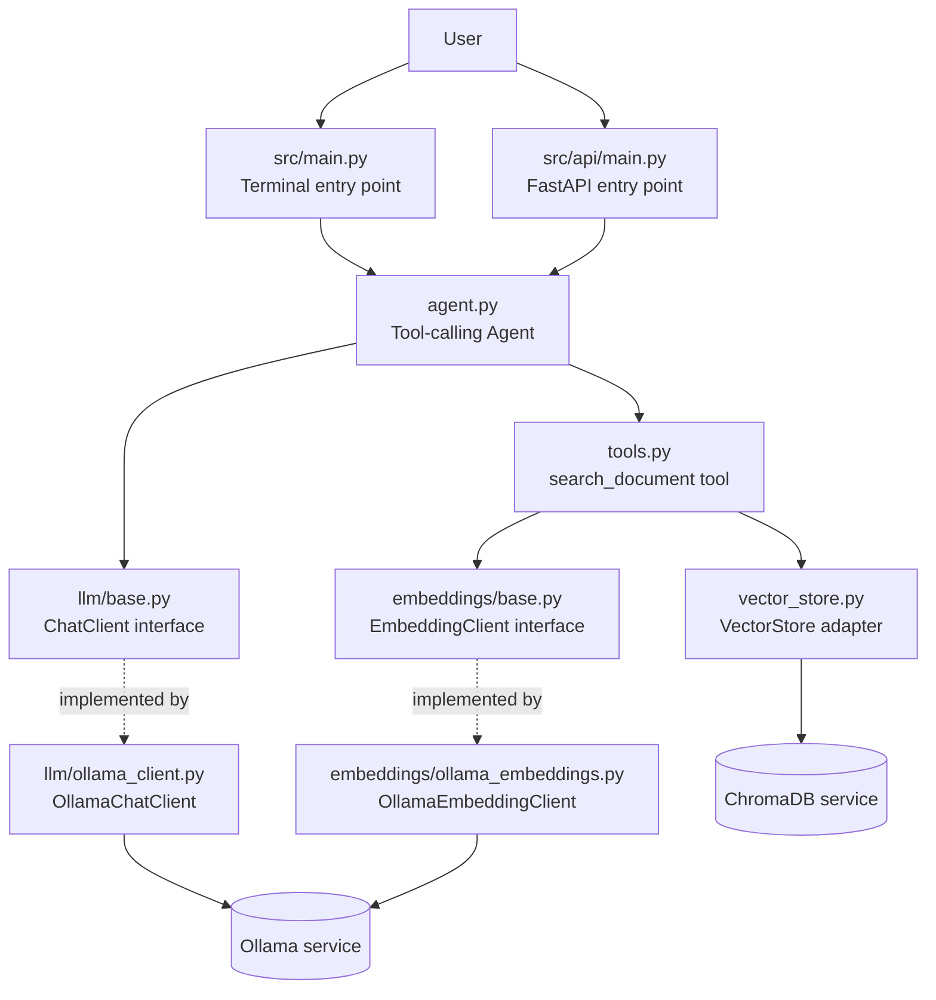
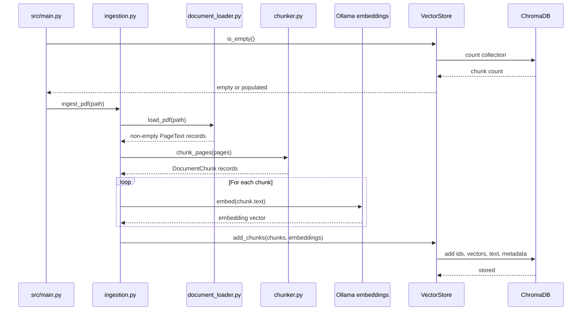
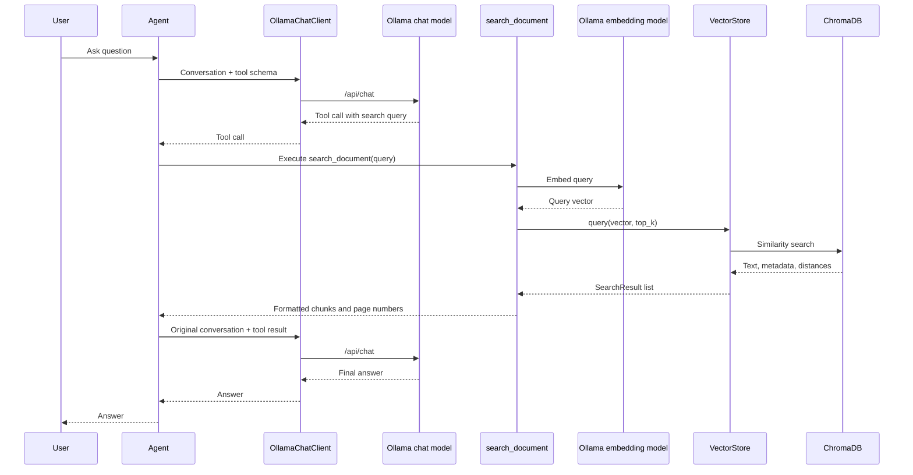
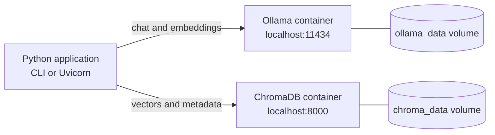

# Local Document Agent

A local retrieval-augmented generation (RAG) application for asking questions
about PDF documents. The application keeps the model, document text, and
vector database on local services:

- **Ollama** generates answers and creates embeddings.
- **ChromaDB** stores document chunks and performs similarity search.
- **PyMuPDF** extracts text from PDFs.
- **Python** coordinates ingestion, retrieval, tool calling, the CLI, and the
  HTTP layer.

This repository is a focused proof of concept. The terminal workflow is the
main usable path. The FastAPI application is a working health/chat skeleton,
while document upload is deliberately still marked as future work.

## What The Application Does

There are two separate workflows:

1. **Ingestion** turns a PDF into searchable records. Text is extracted page
   by page, split into overlapping chunks, embedded by Ollama, and written to
   ChromaDB.
2. **Question answering** sends a question to the chat model. The model can
   call the `search_document` tool, which embeds the question, searches
   ChromaDB, and returns matching chunks with page metadata. The model then
   uses those chunks to write the answer.

The application does not pass the PDF directly to the chat model. The model
sees the document only through the retrieval tool and is instructed to answer
from retrieved content.

## Architecture Overview



### The composition roots

`src/main.py` and `src/api/main.py` are composition roots. They create the concrete
clients, create the vector store, create the `Tools` instance, and register
its `search_document()` method with `Agent`.
then hand those dependencies to `Agent`.

The `Agent` does not import Ollama or ChromaDB. It depends on the small
`ChatClient` interface. The search tool depends on the `EmbeddingClient`
interface and the `VectorStore` abstraction. This keeps provider-specific
code at the edges of the application. Replacing Ollama later means adding a
new implementation of an interface and changing the wiring in one entry
point, rather than rewriting the agent loop.

## Ingestion Architecture

The CLI checks whether the configured Chroma collection is empty. If it is
empty, it calls the shared `ingest_pdf()` function. Keeping ingestion in its
own module means a future upload endpoint can use exactly the same pipeline.



### Ingestion data shape

The classes in `data_models.py` are plain application data structures. They
are not AI models, database ORM models, or serialized API schemas.

| Type            | Purpose                                                        |
| --------------- | -------------------------------------------------------------- |
| `PageText`      | Extracted text and page number for one PDF page.               |
| `DocumentChunk` | A fixed-size text window ready for embedding and storage.      |
| `SearchResult`  | A retrieved chunk with document, page, and relevance metadata. |

The current chunker uses a character window controlled by `CHUNK_SIZE` and
`CHUNK_OVERLAP`. It does not yet understand sentences, paragraphs, headings,
or tables.

## Question-Answering Architecture

The agent owns a conversation containing the system instruction, user
question, model messages, and tool results. It gives the model a maximum of
`MAX_TOOL_ROUNDS` opportunities to call tools. When the model returns a final
message without tool calls, the agent returns that message to the caller.



The tool result contains the retrieved text and source page information. The
system prompt tells the model to use the tool for document questions, avoid
outside knowledge, and mention source pages in its answer. `Agent` catches
tool errors and returns an error message to the model so one failed search
does not necessarily terminate the whole conversation.

## Runtime And Deployment

The Python application normally runs on the host. Ollama and ChromaDB run as
Docker Compose services with their ports published to the host.



Start the services with:

```bash
docker compose up -d
```

Then download the models:

```bash
docker exec -it ollama ollama pull llama3.1:8b
docker exec -it ollama ollama pull nomic-embed-text
```

If the Python application also runs inside Docker on the same Compose
network, use service names instead of `localhost`:

```dotenv
OLLAMA_HOST=http://ollama:11434
CHROMA_HOST=chromadb
```

## Request And Storage Boundaries

### Python application

- Owns orchestration, prompts, tool dispatch, chunking, and configuration.
- Does not persist conversations separately from the running `Agent` object.
- Does not own the ChromaDB data files or Ollama model files.

### Ollama

- `/api/chat` generates the answer and decides whether to call the search
  tool.
- `/api/embeddings` converts document chunks and user queries into vectors.
- Chat and embedding models are configured independently.

### ChromaDB

- Stores chunk text, embeddings, document names, and page numbers.
- Provides collection counts and nearest-neighbor queries.
- Uses the collection named by `CHROMA_COLLECTION`.

The current POC uses one shared collection and does not isolate documents by
user or session. Starting the CLI with a non-empty collection skips
ingestion, even if the PDF path is different.

## Configuration

Configuration is loaded once in `config.py` from environment variables and
`.env`. The main settings are:

| Variable                  | Default                  | Meaning                                                  |
| ------------------------- | ------------------------ | -------------------------------------------------------- |
| `OLLAMA_HOST`             | `http://localhost:11434` | Ollama base URL.                                         |
| `OLLAMA_MODEL`            | `llama3.1:8b`            | Chat model.                                              |
| `OLLAMA_EMBED_MODEL`      | `nomic-embed-text`       | Embedding model.                                         |
| `CHROMA_HOST`             | `localhost`              | ChromaDB host.                                           |
| `CHROMA_PORT`             | `8000`                   | ChromaDB port.                                           |
| `CHROMA_COLLECTION`       | `documents`              | Collection used by the app.                              |
| `CHUNK_SIZE`              | `800`                    | Chunk size in characters.                                |
| `CHUNK_OVERLAP`           | `150`                    | Overlap between adjacent chunks.                         |
| `TOP_K_RESULTS`           | `4`                      | Number of search results.                                |
| `REQUEST_TIMEOUT_SECONDS` | `120`                    | Ollama request timeout. Set to `0` to wait indefinitely. |
| `MAX_TOOL_ROUNDS`         | `4`                      | Maximum model/tool loop iterations.                      |
| `LOG_LEVEL`               | `INFO`                   | Logging verbosity. Use `DEBUG` for request timings.      |

An infinite Ollama timeout is useful for a slow local model, but it also
means a stalled Ollama process will not fail automatically. A positive value
such as `120` is better for unattended jobs.

## Logging And Failure Behavior

The application emits timestamped logs from both entry points. Logs record
operational metadata such as:

- document, page, chunk, and result counts;
- model names and request durations at debug level;
- agent round counts and tool failures;
- HTTP method, path, status, and duration in the API.

Normal application logs do not include document text or user prompts. The
CLI reports an Ollama request failure and continues waiting for another
question. The API middleware logs failed requests, while the current POC
leaves detailed API error handling for a later production pass.

## Running The Application

### Install

```bash
python3 -m venv .venv
source .venv/bin/activate
pip install -r requirements.txt
cp .env.example .env
```

### Run the CLI

```bash
PYTHONPATH=src .venv/bin/python -m main documents/sample.pdf
```

The first run ingests the PDF if the Chroma collection is empty. Later runs
reuse the existing collection. The chat loop keeps running until you type
`exit` or `quit`.

### Run the HTTP skeleton

```bash
PYTHONPATH=src .venv/bin/uvicorn api.main:app --reload
```

Available endpoints:

| Endpoint          | Status  | Behavior                                                              |
| ----------------- | ------- | --------------------------------------------------------------------- |
| `GET /health`     | Working | Returns service status and configured model names.                    |
| `POST /chat`      | Working | Accepts `{"message": "..."}` and returns an answer.                   |
| `POST /documents` | Stub    | Raises `NotImplementedError`; upload and ingestion are not wired yet. |

## Project Structure

```text
local-document-agent/
├── documents/                  # Local PDFs used for ingestion
├── src/
│   ├── api/
│   │   ├── __init__.py         # HTTP API package
│   │   └── main.py             # FastAPI composition root and HTTP routes
│   ├── agent.py                # Conversation and tool-calling loop
│   ├── main.py                 # Terminal composition root and chat loop
│   ├── config.py               # Environment-backed Settings object
│   ├── data_models.py          # PageText, DocumentChunk, SearchResult
│   ├── document_loader.py      # PDF -> non-empty PageText records
│   ├── chunker.py              # PageText records -> overlapping chunks
│   ├── ingestion.py            # Shared load -> chunk -> embed -> store flow
│   ├── logging_config.py       # Shared logging setup
│   ├── tools.py                # Tools class and tool schemas
│   ├── vector_store.py         # ChromaDB adapter
│   ├── embeddings/
│   │   ├── base.py             # EmbeddingClient interface
│   │   └── ollama_embeddings.py  # Ollama embedding implementation
│   └── llm/
│       ├── base.py             # ChatClient interface
│       └── ollama_client.py    # Ollama chat implementation
├── docker-compose.yml          # Ollama and ChromaDB services
├── requirements.txt            # Python dependencies
└── .env.example                # Configuration template
```

## Current Limitations And Next Steps

This design is intentionally small and explicit. The main limitations are:

- Chunking is a fixed character window rather than a structure-aware parser.
- Only text-extractable PDF pages are indexed; scanned pages need OCR.
- One shared collection is used for all documents and users.
- The API has no authentication, request IDs, rate limiting, or durable job
  queue.
- Conversation state lives in an in-memory `Agent` and is not multi-user
  safe.
- The document upload endpoint is not implemented.
- Vector-store type checking and production error responses need hardening.

A natural production evolution would add document IDs and user/session
scoping first, then implement upload jobs, OCR where necessary, structured
chunking, API error contracts, and persistent conversation/session state.
